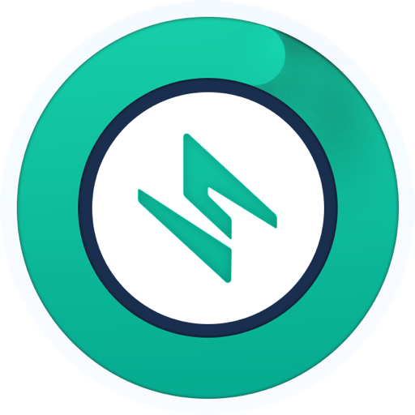

	

<h1 align="center">offline-recovery-tool</h1>

## Introduction

As a self-custodial wallet, Safeheron does not store customers’ private keys. All wallet key shards are stored by a customer self. When a customer terminates Safeheron service, or Safeheron’s service is no longer available, customers can use Offline Private Key Recovery Tool provided by Safeheron to recover all the private keys. The private key recovered can be imported into other hardware and software wallets.

## Get started

If you want to learn how to use the offline recovery tool, 
please visit the [wiki](https://github.com/Safeheron/safeheron-offline-recovery-tool/wiki),
and download our app from [release page](https://github.com/Safeheron/safeheron-offline-recovery-tool/releases).
This README is directed towards those who are interested in contributing to the tool.

## Prerequisites

Make sure you have Rust and NodeJS environment installed.

- Recommended NodeJS version >= 16
- Recommended Rust version >= 1.65.0

## Installation

1. git clone https://github.com/Safeheron/safeheron-offline-recovery-tool.git
2. cd safeheron-offline-recovery-tool
3. npm install

## Development

1. git checkout -b <YOUR_BRANCH_NAME>
2. npm run dev

## Contribution

- make sure `npm test` and `npm run lint` passes.
- pull request to `dev` branch. Do not submit PRs against the `main` branch.
